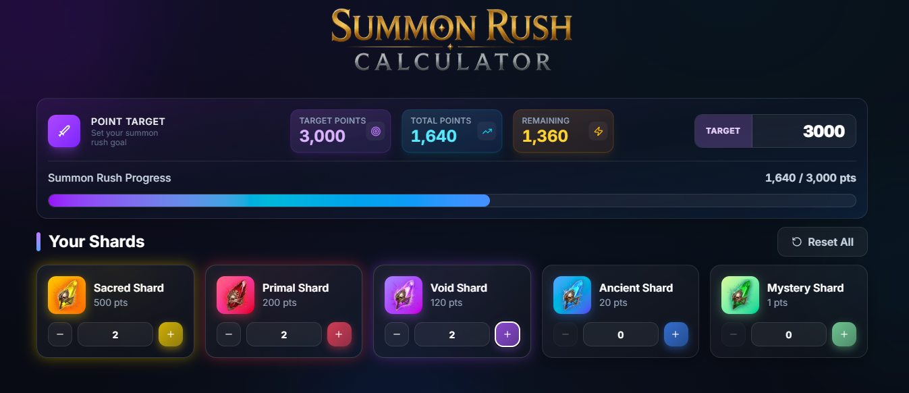

<div align="center">

# RSL Summon Rush Calculator

### Raid: Shadow Legends Shard Planning Tool

A calculator for **Raid: Shadow Legends** players who want to plan Summon Rush events quickly. Set a point target, enter your Sacred, Primal, Void, Ancient, and Mystery shard counts, and instantly see total points, remaining points, and goal progress in a responsive dark-fantasy interface.

[](https://summon-rush-calculator.vercel.app/)
[](https://nextjs.org/)
[](https://react.dev/)
[](https://www.typescriptlang.org/)
[](https://tailwindcss.com/)
[](https://summon-rush-calculator.vercel.app/)

</div>

---

## Preview

<p align="center">
  
</p>

> **Live Site:** [https://summon-rush-calculator.vercel.app/](https://summon-rush-calculator.vercel.app/)

---

## Features

| Feature                   | Description                                                                                 |
| :------------------------ | :------------------------------------------------------------------------------------------ |
| **Summon Rush target**    | Set a custom event point target, with `3,000` points used as the default goal.              |
| **Five shard types**      | Calculates points for Sacred, Primal, Void, Ancient, and Mystery shards.                    |
| **Live point totals**     | Updates total points, remaining points, and target status immediately as quantities change. |
| **Progress bar**          | Visual progress indicator shows how close the current shard plan is to the goal.            |
| **Increment controls**    | Add or subtract shard quantities with dedicated plus and minus buttons.                     |
| **Direct quantity input** | Type shard counts manually with numeric-only input handling.                                |
| **Reset action**          | Clear all shard quantities in one click while keeping the selected target.                  |
| **Persistent planning**   | Saves target, quantities, and calculator state in `localStorage`.                           |
| **RSL-themed visuals**    | Uses shard artwork, glow effects, dark UI styling, and responsive cards.                    |
| **Mobile-ready layout**   | Optimized for phone, tablet, desktop, and wide-screen layouts.                              |

---

## Tech Stack

<div align="center">

|     Technology     | Purpose                                                    |
| :----------------: | :--------------------------------------------------------- |
|   **Next.js 16**   | App framework, routing, metadata, and image optimization   |
|    **React 19**    | Interactive calculator UI and state management             |
|  **TypeScript 5**  | Type-safe components, data models, and app code            |
| **Tailwind CSS 4** | Utility-first styling, responsive layout, and theme tokens |
|  **Lucide React**  | Icons for controls, summary cards, and visual actions      |
|   **next/image**   | Optimized shard and header image rendering                 |
|  **localStorage**  | Client-side persistence for calculator state               |
|     **Vercel**     | Production hosting and deployment                          |

</div>

## Calculator Logic

Default shard values are defined in `src/lib/shards.ts`:

| Shard         | Points Each |
| :------------ | ----------: |
| Sacred Shard  |         500 |
| Primal Shard  |         200 |
| Void Shard    |         120 |
| Ancient Shard |          20 |
| Mystery Shard |           1 |

The main calculator computes:

```text
total points = sum(shard quantity * shard point value)
remaining points = max(0, target points - total points)
progress = min(100%, total points / target points)
```

---

## Getting Started

Install dependencies:

```bash
npm install
```

Run the development server:

```bash
npm run dev
```

Open the app:

```text
http://localhost:3000
```

Build for production:

```bash
npm run build
```

Start the production server:

```bash
npm start
```

Lint the project:

```bash
npm run lint
```

<div align="center">

**Made for Raid: Shadow Legends players who want a faster Summon Rush plan.**

Built with Next.js, React, TypeScript, Tailwind CSS, Lucide React, and Vercel.

</div>
